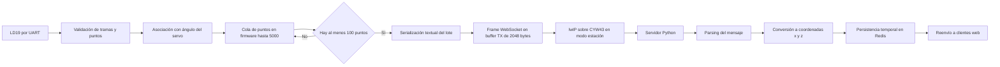
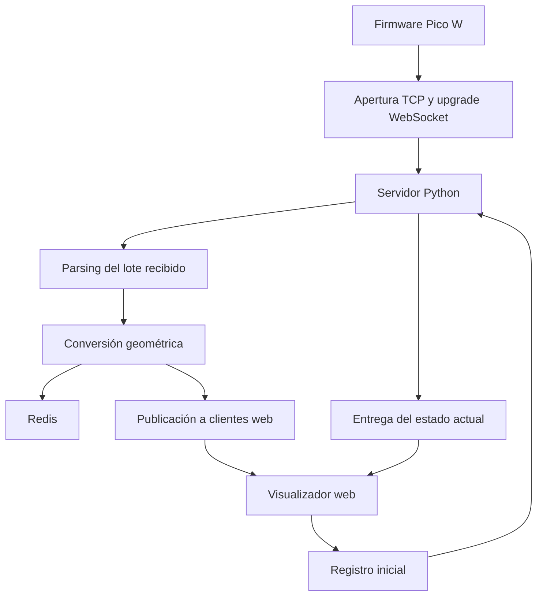

**4.2.2.4 Comunicación inalámbrica y transmisión de datos**

Una vez validadas las mediciones del LD19 y asociadas con la posición instantánea del servo, el sistema debe llevar esos datos fuera del microcontrolador sin interrumpir el barrido. En esta etapa se optó por una comunicación inalámbrica sobre Wi Fi, usando el módulo CYW43 integrado en la Raspberry Pi Pico W. El equipo opera en modo estación y se vincula con una red ya disponible, lo que simplifica la integración con el servidor de procesamiento y evita sumar la gestión de un punto de acceso propio.

La elección de WebSocket responde al comportamiento temporal del sistema. El sensor genera un flujo continuo de puntos y el firmware necesita despachar lotes pequeños de manera sostenida. Con un esquema basado en solicitudes HTTP independientes, cada envío habría incorporado una sobrecarga innecesaria y un patrón de intercambio poco adecuado para telemetría continua. En cambio, WebSocket permite abrir el canal una sola vez y reutilizarlo durante toda la sesión de captura. Eso reduce latencia, evita handshakes repetidos y mantiene un camino directo entre el firmware y el servidor.

**Implementación sobre la Pico W**

La comunicación de bajo nivel se apoya en lwIP, que es la pila TCP IP incluida en el SDK de la plataforma. Sobre esa base se resolvió el upgrade inicial a WebSocket y el armado de los frames de texto. Para esta parte se tomaron como referencia la especificación RFC 6455 y ejemplos públicos orientados a Raspberry Pi Pico W. La decisión de trabajar a este nivel evitó incorporar bibliotecas adicionales y dejó bajo control del firmware aspectos como la apertura del socket TCP, el envío de la solicitud HTTP de upgrade, la verificación de la respuesta del servidor y el encapsulado final del payload.

En términos operativos, la secuencia es breve. Primero se establece el enlace Wi Fi. Luego el cliente TCP se conecta al servidor en el puerto 3000. Cuando el enlace queda disponible, el firmware envía la solicitud de upgrade y verifica la confirmación del servidor mediante la respuesta `101 Switching Protocols`. Desde allí los lotes se transmiten como frames de texto enmascarados, tal como exige el protocolo para mensajes originados en el cliente.

Conviene detenerse un momento en este punto. WebSocket funciona sobre TCP y comienza con una negociación HTTP convencional. Una vez aceptado el upgrade, la comunicación deja de seguir el esquema clásico de pedido y respuesta y pasa a un canal persistente y bidireccional. Cada mensaje viaja dentro de un frame con campos de control bien definidos, entre ellos el bit `FIN`, el `opcode`, la marca de enmascaramiento y la longitud del payload. En este trabajo no fue necesario implementar todas las posibilidades del estándar. Alcanzó con soportar el establecimiento del canal y el envío de frames de texto desde el firmware hacia el servidor.

**Agrupamiento de puntos y formato del mensaje**

El firmware no transmite cada punto de manera aislada. Los datos se almacenan primero en una cola con capacidad para 5 000 elementos. Cuando la cantidad pendiente alcanza 100 puntos, se construye un lote y se envía. Esta política de agrupamiento reduce la frecuencia de frames, mejora el aprovechamiento del canal y mantiene bajo control la relación entre bytes útiles y bytes de protocolo.

El payload se arma como una cadena de texto simple. Cada bloque comienza con el ángulo actual del servo seguido por el delimitador `|`. Después se agregan las tripletas de distancia, intensidad y ángulo horizontal, separadas por `;`. Si dentro del mismo lote aparecen puntos asociados a otra posición del servo, el firmware vuelve a escribir un nuevo encabezado angular y continúa con las tripletas siguientes. En consecuencia, un mismo mensaje puede contener uno o varios grupos angulares consecutivos.

Un ejemplo representativo es el siguiente

`90.0|1200;45;10.5;1180;47;11.0;91.0|1350;52;11.5;`

En ese caso, los dos primeros puntos corresponden a una inclinación de 90.0 grados y el último punto ya pertenece a 91.0 grados. Este detalle es importante porque el servidor no recibe puntos cartesianos finales, sino mediciones polares enriquecidas con la inclinación del servo. La conversión geométrica se realiza después, fuera del microcontrolador.

La estructura del mensaje puede resumirse así

| Componente | Representación | Función |
| --- | --- | --- |
| Ángulo del servo | valor decimal seguido por `|` | Indica la inclinación compartida por los puntos que siguen |
| Distancia | valor entero | Expresa la distancia medida por el LD19 en milímetros |
| Intensidad | valor entero | Conserva la amplitud relativa del retorno |
| Ángulo horizontal | valor decimal | Ubica cada muestra dentro del plano de giro del LiDAR |

**Recorrido completo de los datos**

El trayecto de la información puede describirse como una cadena corta pero bien definida. El LD19 entrega tramas por UART al RP2040. El firmware filtra mediciones inválidas, adjunta el ángulo vertical del servo y las incorpora a la cola principal. Cuando se alcanza el umbral de envío, esas mediciones se serializan en un buffer de texto y luego se encapsulan en un frame WebSocket dentro de un buffer de transmisión de 2 048 bytes. Finalmente, lwIP despacha el contenido a través de la interfaz Wi Fi.

**Figura 4.X**

_Flujo de datos desde la adquisición hasta la visualización_

El punto de quiebre de la arquitectura aparece en el servidor intermedio. Allí se recibe el mensaje crudo, se interpreta la secuencia de grupos angulares y se reconstruye cada punto individual. Después se aplica la transformación a coordenadas cartesianas usando la inclinación del servo, el ángulo horizontal del sensor, la distancia medida y un desplazamiento fijo asociado a la geometría del montaje. Este reparto de responsabilidades evita cargar al RP2040 con operaciones que no son críticas en la etapa de captura y aprovecha mejor la capacidad de cómputo del servidor.

Además de procesar la nube entrante, el servidor cumple una función de desacople. Por un lado recibe el flujo continuo del firmware. Por otro lado mantiene el estado del escaneo en Redis y redistribuye los nuevos puntos a los clientes de visualización conectados por WebSocket. Gracias a esa separación, el firmware queda concentrado en medir y transmitir, mientras que el backend se ocupa de transformar, almacenar y publicar los datos ya listos para la interfaz.

**Figura 4.X**

_Interacción entre firmware, backend y visualizador_

Desde el punto de vista de diseño, este esquema ofrece un equilibrio razonable entre simplicidad y rendimiento. El firmware mantiene una lógica de comunicación acotada, con un formato fácil de inspeccionar durante las pruebas. El servidor, en cambio, absorbe la parte más flexible del procesamiento y habilita la visualización en tiempo real sin exigir que el microcontrolador conozca detalles de la interfaz final.
