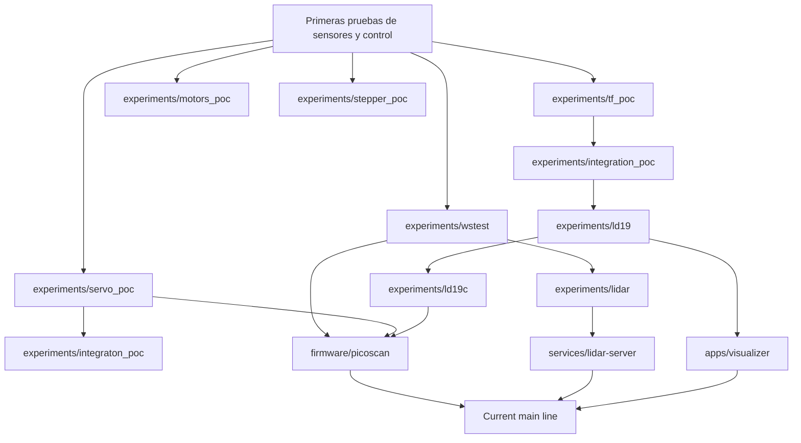

# Evolution Lineage

```mermaid
flowchart TD
    Start[Primeras pruebas de sensores y control] --> TFMini[experiments/tf_poc]
    Start --> Motors[experiments/motors_poc]
    Start --> Servo[experiments/servo_poc]
    Start --> Stepper[experiments/stepper_poc]
    Start --> WS[experiments/wstest]

    TFMini --> Integration[experiments/integration_poc]
    Servo --> Integraton[experiments/integraton_poc]
    WS --> LegacyLidar[experiments/lidar]
    Integration --> LD19[experiments/ld19]
    LD19 --> LD19C[experiments/ld19c]

    LegacyLidar --> Server[services/lidar-server]
    LD19 --> Visualizer[apps/visualizer]
    WS --> PicoScan[firmware/picoscan]
    Servo --> PicoScan
    LD19C --> PicoScan

    PicoScan --> Final[Current main line]
    Server --> Final
    Visualizer --> Final
```

## Lectura

La línea final no borra el trabajo previo: lo encapsula. `experiments/` conserva la historia; `firmware/`, `services/` y `apps/` muestran el producto actual.
