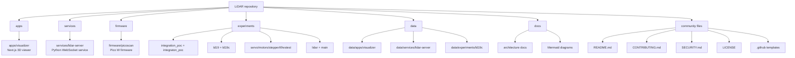

# Repository Map

```mermaid
flowchart TD
    Repo[LiDAR repository]

    Repo --> Apps[apps]
    Repo --> Services[services]
    Repo --> Firmware[firmware]
    Repo --> Experiments[experiments]
    Repo --> Data[data]
    Repo --> Docs[docs]
    Repo --> Community[community files]

    Apps --> Visualizer[apps/visualizer\nNext.js 3D viewer]
    Services --> LidarServer[services/lidar-server\nPython WebSocket service]
    Firmware --> PicoScan[firmware/picoscan\nPico W firmware]

    Experiments --> ExpPOCs[integration_poc + integraton_poc]
    Experiments --> ExpLD19[ld19 + ld19c]
    Experiments --> ExpHardware[servo/motors/stepper/tf/wstest]
    Experiments --> ExpLegacy[lidar + main]

    Data --> DataApps[data/apps/visualizer]
    Data --> DataServices[data/services/lidar-server]
    Data --> DataExp[data/experiments/ld19c]

    Docs --> Arch[architecture docs]
    Docs --> Diagrams[Mermaid diagrams]

    Community --> RootReadme[README.md]
    Community --> Contrib[CONTRIBUTING.md]
    Community --> Security[SECURITY.md]
    Community --> License[LICENSE]
    Community --> GithubTemplates[.github templates]
```
