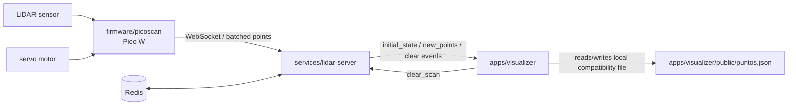

# Runtime Architecture

```mermaid
flowchart LR
    Sensor[LiDAR sensor] --> Pico[firmware/picoscan\nPico W]
    Servo[servo motor] --> Pico
    Pico -->|WebSocket / batched points| Server[services/lidar-server]
    Redis[(Redis)] <--> Server
    Server -->|initial_state / new_points / clear events| Web[apps/visualizer]
    Web -->|clear_scan| Server
    Web -->|reads/writes local compatibility file| Puntos[apps/visualizer/public/puntos.json]
```

## Notas

- `puntos.json` vive en `apps/visualizer/public/` porque el frontend lo usa directamente.
- Snapshots y archivos auxiliares relacionados se documentan en `data/`.
