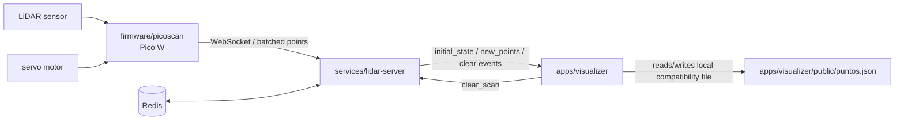

# Runtime Architecture

## Notas

- `puntos.json` sigue en `apps/visualizer/public/` por compatibilidad actual.
- Los snapshots auxiliares ya no viven dentro del runtime principal; fueron movidos a `data/`.
