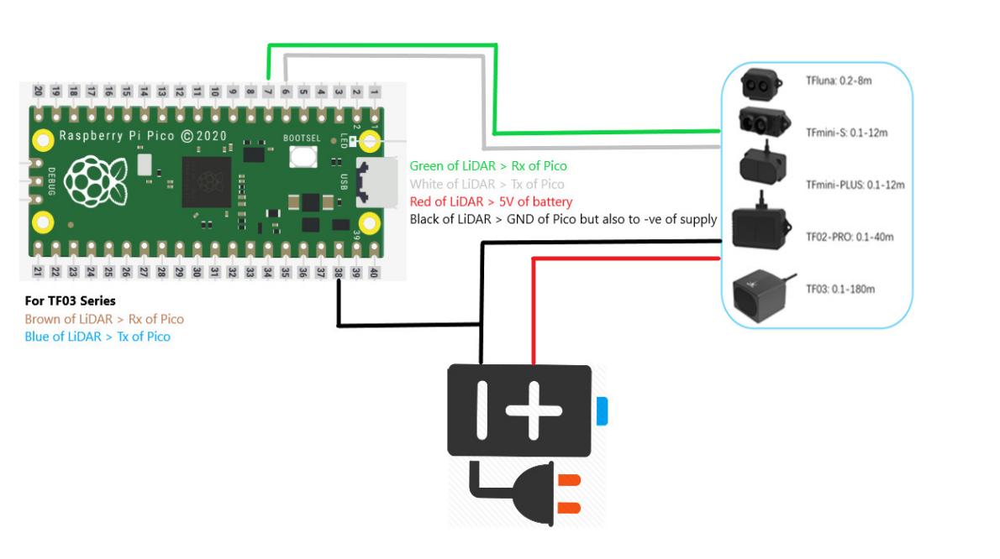
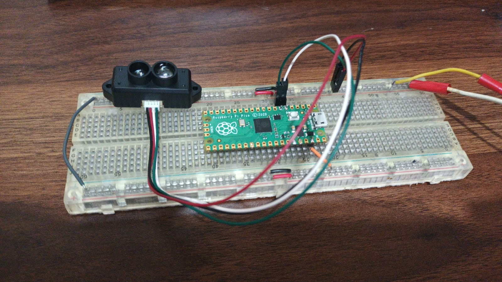

# Tf-Mini/s POC

## Overview

The goal of this project is to use a Raspberry Pi Pico to run a TF-Mini/S Lidar sensor using the C SDK. The TF-Mini/S is a compact and lightweight lidar sensor that can measure distances up to 12 meters with an accuracy of ±2 cm.

## Hardware Requirements

- Raspberry Pi Pico
- TF-Mini/S Lidar sensor
- Jumper wires
- Breadboard (optional)
- +5V power supply
- USB cable for programming the Pico
- Computer with a USB port

## Connection Diagram



## VsCode Extensions

- Install [Raspberry Pi Pico Extension](https://marketplace.visualstudio.com/items?itemName=raspberry-pi.raspberry-pi-pico).
- Create a new project using the extension.
- Press Bootsell on the Pico and connect it to your computer. (You can release the button after the Pico is connected.)
- Using the extension, upload the code to the Pico.
- Open the serial monitor to see the output from the Pico. With screen command:

```bash
screen /dev/ttyACM0 115200
```

## Physical Setup



## References

> **Special thanks to Ibrahim (FAE) for the article "Interfacing TF Series Single Point LiDARs with Raspberry Pi Pico"**
